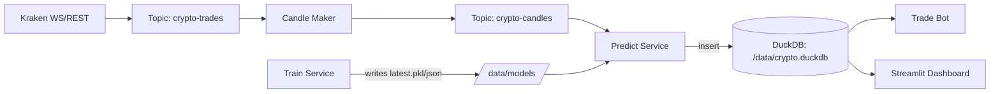

# Crypto MLOps Trading Platform (Kafka/Redpanda + DuckDB + LightGBM + Streamlit)

An end-to-end **MLOps + streaming** system for crypto signal generation and **paper trading**.

**What it does**
- Ingests live BTC/USD trades from Kraken
- Streams trades through Kafka (Redpanda) and aggregates **1-minute candles**
- Persists candles + predictions to **DuckDB**
- Trains a LightGBM classifier on rolling history (Optuna tuning)
- Runs continuous inference and writes predictions
- Simulates trading strategies (paper trading) and visualizes performance in Streamlit

> ⚠️ This is a research / educational platform. It does **not** place real orders and is **not financial advice**.

---

## Architecture (end-to-end)

**Dataflow**
1) Kraken WS/REST → `crypto-trades` (topic)
2) Stream aggregation → `crypto-candles` (topic)
3) Candle persistence + inference → DuckDB (`candles`, `predictions`)
4) Trading simulation → DuckDB (`tradebot_state`)
5) Streamlit dashboard reads from DuckDB + model metadata



## Key Components

- **Redpanda**: Kafka-compatible broker

- **Topics**
  - `crypto-trades`: raw trades (event stream)
  - `crypto-candles`: 1-minute candle events

- **DuckDB (persistent)**
  - `candles`: candle OHLCV + trade counts
  - `predictions`: model `signal` + `proba` per interval
  - `tradebot_state`: portfolio state over time

- **Model**
  - LightGBM classifier
  - Target: direction in the next **N minutes** (configured in training)
  - Artifacts:
    - `/data/models/latest.pkl`
    - `/data/models/latest.json`

---

## Repo Structure (high-level)

- `services/`
  - `backfill/` historical trades → candles
  - `realtime/` Kraken WebSocket → `crypto-trades`
  - `candle_maker/` consumes `crypto-trades` → produces `crypto-candles`
  - `predict/` consumes `crypto-candles` → DuckDB + predictions
  - `train/` trains model + updates latest artifacts
  - `trade_bot/` reads predictions → paper trading state
  - `streamlit_app/` dashboard

- `docker-compose.yml` orchestrates all services
- `data/` (local, ignored) DuckDB + models + logs

---

## 📊 Results & Demo

> These results are from **paper-trading simulations** and a short evaluation window. Performance can vary significantly across different market regimes.  
> This project is for **research/education** and does **not** place real orders. Not financial advice.

### Model Metrics (latest run)
The Streamlit dashboard displays the latest model evaluation metrics:

- **Accuracy:** ~0.53  
- **F1 Score:** ~0.40  
- **Precision:** ~0.53  
- **Recall:** ~0.32  

> Note: Classification metrics alone don’t guarantee trading profitability; the trading loop depends heavily on thresholds, fees, slippage, and market conditions.


### Trading Simulation (paper trading)
We simulate three strategies (Dynamic / Balanced / Ultra-Aggressive) using the model’s `signal` and `proba`.

Example run (short window) shows the **portfolio value over time** and final balances:


---


## Quickstart (local)

### 0) Prereqs
- Docker + Docker Compose installed

### 1) Build base image + start stack
```bash
docker build -t ml-trading-service ./services/base
docker-compose up -d

2) Configure environment

Copy and edit:

cp .env.example .env

3) Backfill 30 days of history (build initial candles)
docker exec -it backfill bash -lc "python fetch_historical_trade_data.py && python load_historical_data_as_candles.py"

4) Start realtime ingestion + stream processing
docker exec -it realtime bash -lc "python fetch_realtime_data.py"
docker exec -it candle_maker bash -lc "python candle_maker.py"

5) Start prediction service (writes to DuckDB)
docker exec -it predict bash -lc "python process_candle.py"

6) Train the model (writes /data/models/latest.*)
docker exec -it train bash -lc "python train.py"

7) Start paper trading bot
docker exec -it trade_bot bash -lc "python trade_bot.py"

8) Launch Streamlit
docker exec -it streamlit_app bash -lc "streamlit run streamlit_app.py --server.port 8501 --server.address 0.0.0.0"


Open: http://localhost:8501


